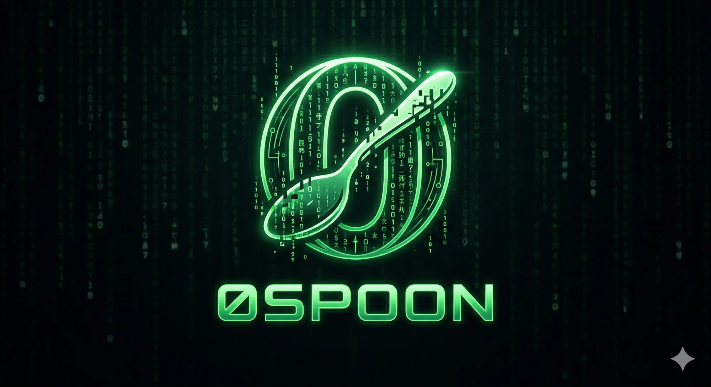

  

  
  
  

# 0spoon

> _"Do not try to bend the spoon. That's impossible. Instead, only try to realize the truth... there is no spoon."_

Open-source infrastructure for AI coding agents — **without pretending the agent is in charge.**

The agent doesn't know your project. It doesn't remember yesterday. It forgets why it made a decision and starts every conversation from zero. The fix isn't a smarter model. The fix is infrastructure: durable memory, real coordination primitives, and artifacts you can read without the agent in the loop.

0spoon builds that infrastructure. Local-first. Filesystem-native. Single-user. Markdown on disk, nothing hiding in a vendor's database.

---

## Projects

### [Seamless](https://github.com/0spoon/seamless) — _memory and coordination for agent fleets_

A local-first memory and coordination substrate for AI coding agents. Seamless gives a fleet of agents — Claude Code and any MCP-compatible client — a shared, durable memory and a way to divide work without colliding: memories with a supersession lifecycle, hybrid recall, a dependency-aware task queue with lease-based claiming, captured plans, and research trials. What one agent learns, the next one knows.

Durable knowledge is stored as markdown files on disk. A single Go binary indexes it, serves it over MCP, and renders a web console for inspection. No CGO, no Node, no separate vector engine, no cloud account.

**Website & docs: [thereisnospoon.org](https://thereisnospoon.org)** — [Quickstart](https://thereisnospoon.org/docs/quickstart/) · [Claude Code setup](https://thereisnospoon.org/docs/claude-code/) · [Concepts](https://thereisnospoon.org/docs/concepts/) · [Reference](https://thereisnospoon.org/docs/reference/)

---

## Principles

**Local-first, always.** Your files, your disk, your machine. No cloud account required.

**Files are the source of truth.** Every memory and note is a markdown file with YAML frontmatter — git-diffable, greppable, hand-editable. The database is a rebuildable index; delete it and lose nothing.

**Built for a fleet, not a lone agent.** Real coordination primitives — a dependency-aware ready-queue, atomic lease-based task claiming, shared research trials — so agents divide labor instead of colliding.

**Curation proposes, humans dispose.** Automated tidying only proposes; applying is an explicit action. Supersession preserves provenance, so nothing is silently rewritten.

**The agent is a tool, not a teammate.** You stay the protagonist. The infrastructure exists so the model does more useful work — not so you do less thinking.

---

## License

Everything here is MIT unless a repo says otherwise.
